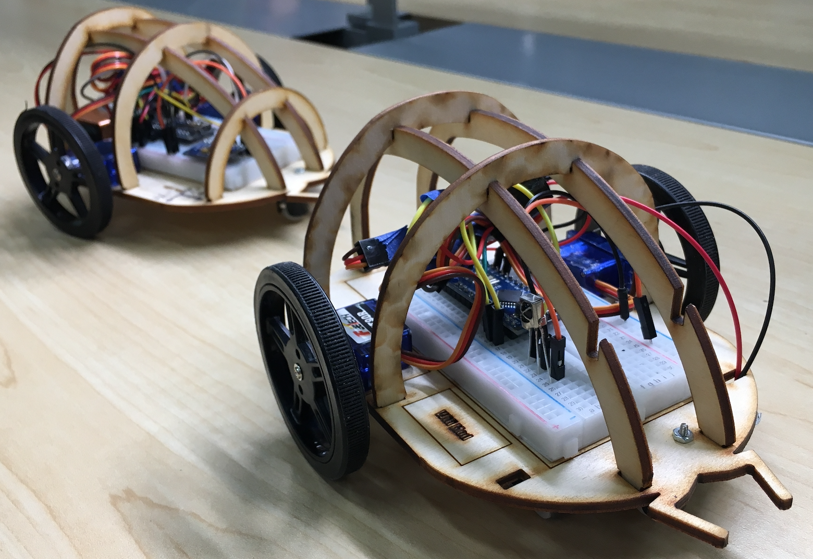

# SwarmBot

## Overview 
The idea of this project is to build two robots that can follow each other.
- Leader robot can be controlled via IR remote.
- Follower robot will follow the leader robot.

## Demo
View our video demo [HERE](https://youtube.com/playlist?list=PLqjD3kOeMJ30w4-lZASz9D7ZoOwoZ2KZG)

## Hardware
Robot is equipped with the following sensor and equipment:
- arduino nano
- IR Receiver (for remote control)
- 360 servo (turns the wheel)
- rare earth magnet (allow tracking)
- magnetometer (sense the direction of leader robot)

See the full [parts list](SwarmBot_Parts_List.pdf).

## Software
Following code can be loaded to arduino nano via arduino ide.
- [Decoding signal from IR remote](code/IR_remote_decode.ino)
- [Controlling servo using IR remote](/code/servo_IRremote.ino)
- [Magnetometer demo](code/MPU9250_demo.ino)

## CAD Files
- [Laser cutting file](CAD_files/SB2.svg)
- [3D Design](CAD_files/Chasis.ipt) (Autodesk Inventor)
  
## Documentation
For more build and technical details, see [developer guide](Developer_Guide_SwarmBot.pdf).

## Contribution
This project is collaborated with Wesley and Carl, supported by UCSD PiB.